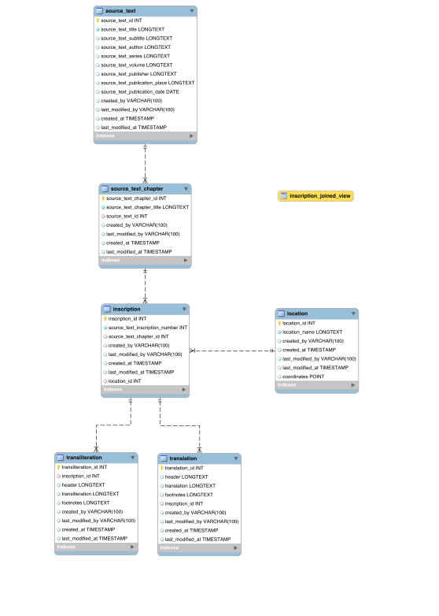

# Epigraphia Carnatica Online application/database

<!-- TOC start (generated with https://github.com/derlin/bitdowntoc) -->

- [Access](#access)
- [ER Schema](#er-schema)
- [Backend](#backend)
- [REST APIs](#rest-apis)
   * [Source Text (Book)](#source-text-book)
   * [Source Text Chapter (Book Chapter)](#source-text-chapter-book-chapter)
   * [Location](#location)
   * [Inscription](#inscription)

<!-- TOC end -->

This repo will contain code for the REST APIs to access the database containing 'cleaned' inscriptions from Epigraphia Carnatica (EC). 
See ['Cleaning' Epigraphia Carnatica for Knowledge Graphs](https://github.com/ShreyasKolpe/epigraphia-data-cleaning) for details 
on the (currently manual) process of obtaining cleaned information from EC.

The database is being built privately and step-by-step. Once the backend and frontend are in place, the database is planned 
to be hosted online. Building on this, the database is intended to feed into a project to build knowledge graphs from the 
inscriptions in EC. This is planned as a prototype.

## Access

Access the prototype at https://epigraphiacarnatica.pythonanywhere.com/
To use the APIs, use this as the base url to which to add the rest of the path.

## ER Schema

The following ER schema has been developed:

EC is a series of volumes (here called **source_text**). Each volume has chapter-like geographical subdivisions (here called **source_text_chapter**). 
The real world 'object' is the inscription itself (called **inscription**), whose information is spread across the book under different
headings, but using a single numbering for the geographical subdivision. Primarily, this is three-fold: the inscription text in Indic script, 
inscription text in 'Roman' (Latin) characters, and translation in English. At this stage, the project only involves itself with
the latter two (called **transliteration** and **translation** respectively).
Each inscription is associated with a location (represented by the **location** object).

## Backend

The backend will be developed in Python using the Django framework.

Some thoughts:
1. Django is chosen as it enables rapid development. Python was a requirement keeping in mind extensibility to knowledge graphs, AI and NLP through Python support in such software.
2. Resources to learn Django:

    - [Programming with Harry](https://www.youtube.com/playlist?list=PLK8cqdr55Tsv-D2HMdrnD32oOVBNvmxjr)

    - Django [documentation](https://docs.djangoproject.com/en/4.0/), especially about models, fields and querying.

    - Developing REST applications in [plain Django](https://stackabuse.com/creating-a-rest-api-in-python-with-django/) or with [Django REST Framework](https://stackabuse.com/creating-a-rest-api-with-django-rest-framework/). Both tutorials are brilliant and lay out the costs of choosing either approach. In this project, plain Django is used.

3. The Django admin portal provides CRUD operations on database through a UI and obliviates a good deal of rationale for generating own data entry portal involving Auth. Further customization through this [tutorial](https://realpython.com/customize-django-admin-python/). Customizing forms to have multiple models in the same form - look at [this](https://books.agiliq.com/projects/django-admin-cookbook/en/latest/edit_multiple_models.html).
4. Free small-scale hosting of Python based applications including web apps at [Python Anywhere](https://www.pythonanywhere.com/).
5. Solving a probelm with models and forms: [my gist on the issue](https://gist.github.com/ShreyasKolpe/d5d7271d9fb3b27ce0abe76d3bf7f0bd)

## REST APIs

Register APIs are meant to be create or update i.e., upsert.


Get APIs are read-only. (Here, the semantics of get is that of fetching, and not that of HTTP GET method. Thus, get is sometimes performed using POST as well)

### Source Text (Book)

1. **Register the text**

Request:

```
POST /api/v1/source_text

{
	"title": "",
    "subtitle": "",
    "series": "",
    "volume": "",
	"author": "",
    "publisher": "",
    "publication_place": "",
	"publication_year": ""
}
```

**Note**: `title` is the only mandatory field, other fields can be blank

Response:

```
{
    "status": 200,
    "message": "Source text registered successfully",
    "data": {
        "id": ,
        "title": "",
        "subtitle": "",
        "series": "",
        "volume": "",
        "author": "",
        "publisher": "",
        "publication_place": "",
        "publication_year": ""
    }
}
```

Errors:


| HTTP Status | Error Condition |
|-------------|-----------------|
| 400, Bad Request | If title is blank |


2. **Get source text by id**

Request:

```
GET /api/v1/source_text/<id:int>
```

Response:

```
{
    "status": 200,
    "message": "Successfully found this record"
    "data":  {
        "id": ,
        "title": "",
        "series": "",
        "volume": "",
        "author": "",
        "publisher": "",
        "publication_place": "",
        "publication_year": ""
    }    
}
```

Errors:


| HTTP Status | Error Condition |
|-------------|-----------------|
| 404, Not Found | If no text matches with request  |


3. **Get all registered texts**

Request:

```
GET /api/v1/source_text
```

Response:

```
{
    "status": 200,
    "message": "Successfully found these records",
    "source_texts": [ 
        {
            "id": ,
            "title": "",
            "subtitle": "",
            "series": "",
            "volume": "",
        },
        ...
    ]
}
```


### Source Text Chapter (Book Chapter)

1. **Register the chapter**

Request:

```
POST /api/v1/source_text_chapter

{
	"chapter_title": "",
	"source_text": {
        "id": ,
		"title": "",
        "subtitle": "",
        "series": "",
		"volume": ""
	}
}
```

**Note**: `chapter_title` is a mandatory field. To identify `source_text` provide either the `id` or a combination of the other attributes. 

Response:

```
{
    "status": 200,
    "message": "Chapter registered successfully",
    "data": {
        "chapter_id": ,
        "chapter_title": "",
        "source_text": {
            "id": ,
            "title": "",
            "subtitle": "",
            "series": "",
            "volume": "",
        }
    }
}
```

Errors:


| HTTP Status | Error Condition |
|-------------|-----------------|
| 400, Bad Request | 1. If chapter title is blank or if no source text is provided |
|                  | 2. If no source text matches or more than one source texts match with provided information | 

2. **Get chapter by id**

Request:

```
GET /api/v1/source_text_chapter/<id:int>
```

Response:

```
{
    "status": 200,
    "message": "Successfully found this record",
    "data": {
        "chapter_id": ,
        "chapter_title": "",
        "source_text": {
            "id": ,
            "title": "",
            "subtitle": "",
            "series": "",
            "volume": "",
        }
    }
}
```

Error:

| HTTP Status | Error Condition |
|-------------|-----------------|
| 404, Not Found | If no chapter matches the id  |

3. **Get all registered chapters for a source text**


Request:

```
POST /api/v1/source_text_chapter/search

{
    "source_text": {
        "id": ,
        "title": "",
        "subtitle": "",
        "series": "",
        "volume": ""
    }
}
```

**Note**:  To identify `source_text` provide either the `id` or a combination of the other attributes. 

Response:

```
{
    "status": 200,
    "message": "Successfully found these records",
    "data": [
        {
            "chapter_id": "",
            "chapter_title": "",
            "source_text": {
                "id": ,
                "title": "",
                "subtitle": "",
                "series": "",
                "volume": ""
            }
        },
        ...
    ]
}
```

### Location

1. **Get a location by id**

Request:

``` 
GET /api/v1/location/<id:int>
```

Response:

```
{
    "status": 200,
    "message": "Successfully found this record",
    "data": {
        "location_id": ,
        "location_name": "",
        "coordinates":
    }
}
```

Error:

| HTTP Status | Error Condition               |
|-------------|-------------------------------|
| 404, Not Found | If no location matches the id |


2. **Get all locations**

Request:

``` 
GET /api/v1/location
```

Response:

```
{
    "status": 200,
    "message": "Successfully found these records",
    "data": []
}
```


### Inscription

1. **Register transliteration and/or translation for inscription**

Request:

```
POST /api/v1/inscription

{
    "chapter": {
        "id": ,
        "title": ""
    },
    "inscription_id": ,
    "inscription_number": "",
    "translation_header": "",
    "translation": "",
    "translation_footer": "",
    "transliteration_header": "",
    "transliteration": "",
    "transliteration_footer": ""
}
```

**Note**: Provide either `id` or `title` to identify chapter. `inscription_number` cannot be null. `inscription_id` is provided for programmatic upsert and is not mandatory. The backend will first check if record exists, and then update the translation and transliteration attributes. Else, it will insert into the database and create the foreign key relations.

Response:

```
{
    "status": 200,
    "message": "Successfully registered translation and/or transliteration",
    "data": {
        "source_text": {
            "id": ,
            "title": "",
            "subtitle": "",
            "series": "",
            "volume": "",
            "author": "",
            "publisher": "",
            "publication_place": "",
            "publication_date": ""
        },
        "chapter": {
            "id": ,
            "title": "",
        }
        "inscription_id": ,
        "inscription_number": "",
        "translation_header": "",
        "translation": "",
        "translation_footer": "",
        "transliteration_header": "",
        "transliteration": "",
        "transliteration_footer": ""
    }
}
```

Error:

| HTTP Status | Error Condition |
|-------------|-----------------|
| 400, Bad Request | 1. If inscription_id is absent and if chapter info. or inscription_number are missing |
|                  | 2. If no chapter matches or more than one chapters match with provided info. |
| 404, Not Found | If inscription_id is supplied but no inscription matches it  |

2. **Get complete inscription object by id**

Request:

```
GET /api/v1/inscription/<inscription_id:int>
```

Response:

```
{
    "status": 200,
    "message": "Successfully found this record",
    "data": {
        "source_text": {
            "id": ,
            "title": "",
            "subtitle": "",
            "series": "",
            "volume": ""
            "author": "",
            "publisher": "",
            "publication_place": "",
            "publication_date": ""
        },
        "chapter": {
            "id": ,
            "title": "",
        }
        "inscription_id": ,
        "inscription_number": "",
        "translation_header": "",
        "translation": "",
        "translation_footer": "",
        "transliteration_header": "",
        "transliteration": "",
        "transliteration_footer": ""
    }
}
```

Error:

| HTTP Status | Error Condition |
|-------------|-----------------|
| 404, Not Found | If no inscription matches the id  |

3. **Get inscriptions by text, chapter, location or inscription number**

Request:

```
POST /api/v1/inscription/search

{
    "source_text": {
        "id": ,
        "title": "",
        "subtitle": "",
        "series": "",
        "volume": ""
    },
    "chapter": {
        "id": ,
        "chapter_title": ""
    },
    "location": {
        "id": ,
        "location_name": ""
    },
    "inscription_number": 
}
```

**Note**: 

1. To identify `source_text` provide either the `id` or a combination of the other attributes. Some such 
information is necessary. To identify `chapter` provide either its `id` or `chapter_title`. To identify `location` 
provide either its `id` or `location_name`.None of the attributes  are truly mandatory for the API, they act only as filters.
2. In the case of `source_text`, `chapter` and `location`, the `id` if provided will be used before looking for the other attributes.


Response:

```
{
    "status": 200,
    "message": "Successfully found these records"
    "data": [
        {
            "source_text": {
                "id": ,
                "title": "",
                "subtitle": "",
                "series": "",
                "volume": ""
                "author": "",
                "publisher": "",
                "publication_place": "",
                "publication_date": ""
            },
            "chapter": {
                "id": ,
                "title": "",
            },
            "location": {
                 "id": ,
                 "location_name": "",
                 "coordinates": []
            }
            "inscription_id": ,
            "inscription_number": "",
            "translation_header": "",
            "translation": "",
            "translation_footer": "",
            "transliteration_header": "",
            "transliteration": "",
            "transliteration_footer": ""
        },
        ...
    ]
}
```

Error:

| HTTP Status | Error Condition |
|-------------|-----------------|
| 404, Not Found | If no inscription matches the filters  |